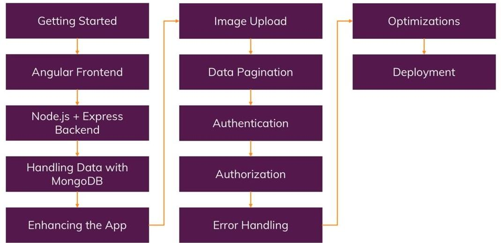

# Welcome to the MEAN Bootcamp! 🚀

Explore our comprehensive collection of resources and hands-on examples tailored to accelerate your mastery of the MEAN (MongoDB, Express.js, Angular, Node.js) stack. Whether you're a beginner venturing into full-stack development or an experienced programmer aiming to expand your skillset, our meticulously designed modules and practical projects are here to guide you through each technology's nuances.

Immerse yourself in the realm of database management with **MongoDB**, craft robust server-side applications using **Express.js** and **Node.js**, and design dynamic user interfaces with **Angular**. Embark on this learning journey to gain the practical expertise necessary for building modern, scalable web applications. Get ready to supercharge your development prowess with the formidable power of **MEAN**!

## MEAN Stack Bootcamp Outline

  <div>
    
  </div>

  ## The Angular Frontend - Understanding the Basics
  1. Getting User Input
  2. Getting User Input with ngModule
  3. Angular Material
     1. ``` ng add @angular/material ``` 
     2. Using MatInputModule, MatCardModule and MatButtonModule
  
