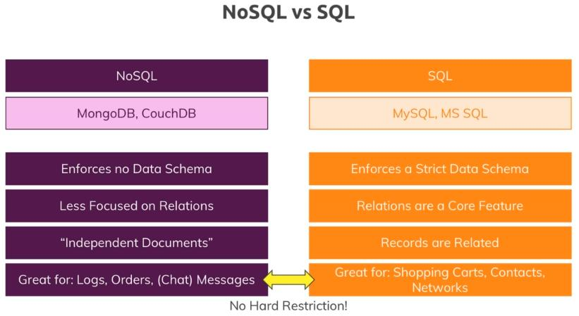

# Welcome to the MEAN Bootcamp! 🚀

Explore our comprehensive collection of resources and hands-on examples tailored to accelerate your mastery of the MEAN (MongoDB, Express.js, Angular, Node.js) stack. Whether you're a beginner venturing into full-stack development or an experienced programmer aiming to expand your skillset, our meticulously designed modules and practical projects are here to guide you through each technology's nuances.

Immerse yourself in the realm of database management with **MongoDB**, craft robust server-side applications using **Express.js** and **Node.js**, and design dynamic user interfaces with **Angular**. Embark on this learning journey to gain the practical expertise necessary for building modern, scalable web applications. Get ready to supercharge your development prowess with the formidable power of **MEAN**!

## MEAN Stack Bootcamp Outline

  <div>
    
  </div>

  ## The Angular Frontend - Understanding the Basics
  1. Getting User Input
  2. Getting User Input with ngModule
  3. Angular Material
     1. ``` ng add @angular/material ``` 
     2. Using ***MatInputModule, MatCardModule and MatButtonModule***
     3. Adding a Toolbar
     4. Post list with ***mat-expansion-panel***
  4. Creating Posts with Event Binding ***(@Output(), @Input())*** and creating a Post Model``` ng g interface Post --type=model ```
  5. Adding a form and handling messages errors
  6. Get Posts from Post-Create to Post-List using ***service***
      1. ``` ng g s posts/post --skip-tests=true ``` to create a service PostService
      2. Calling Get Post using service: ***Observables, Observers and Subscription***
      3. Enhancing the form  
## Adding NodeJS to our Project
1. Adding the Node Backend and Express Framework
   1. Create a ***backend folder*** and ***server.js***
   2. ``` npm install --save express ``` and create ***app.js*** file (as a middleware) inside backend folder
   3. Improving the server:
      1. Enhancing server.js
      2. ``` npm install --save-dev nodemon ``` to automatically restarting the node application when file changes
      3. Add ***"start:server": "nodemon server.js"*** in ***package.json*** (npm run start:server) to run server
      4. Remove errors of nodemon by adding ``` const debug = require('debug')('node-angular'); ```
2. Fetching Initial Posts: ``` http://localhost:3000/api/posts```
3. Using ***Angular HTTP Client and CORS***
4. Adding the POST Backend Point:
   1. ```npm install --save body-parser```
   2. Create a post request
   3. Add addPost method in PostService
## Working with MongoDB
***MongoDB is a NoSQL Database which stores "Documents" in "Collections" (instead of "Records" in "Tables" as in SQl) Easily connected to Node/Express (NOT to Angular!)***
   <div>
      
   </div>

1. Setting Up MongoDB cluster by using [Free Sandbox](https://www.mongodb.com/atlas/database)
2. Using Mongoose ```npm install mongoose --save ```
   1. Add Schemas and Models in post.js file
   2. Creating a Post instance
   3. Connect the Node Express App to MongoDB
   4. Install MongoDB Shell ***mongosh*** to manage mongodb with [terminal](https://www.mongodb.com/docs/mongodb-shell/install/#procedure) 
      1. Run your connection string in your command line by using this connection string in your application ```mongosh "mongodb+srv://cluster0.dca3xkg.mongodb.net/" --apiVersion 1 --username maher```
      2. Write on terminal ```use node-angular``` get on outputting ***switched to db node-angular***
      3. Command line to handle Mongodb:
         * ```show collections``` 
         * ```db.posts.find()```  
   5. Fetching Data From a Database:
         * [CRUD operations](https://mongoosejs.com/docs/queries.html) 
3. Transforming Response Data (for example to remove _ from id)  
4. Deleting Documents and refresh data
5. Adding Posts with an ID to solve probleme of ***id is null***
## Enhancing the App
1. Add Routing ```ng generate module app-routing --flat --module=app``` 
2. Creating the ***Edit Post*** on the server
